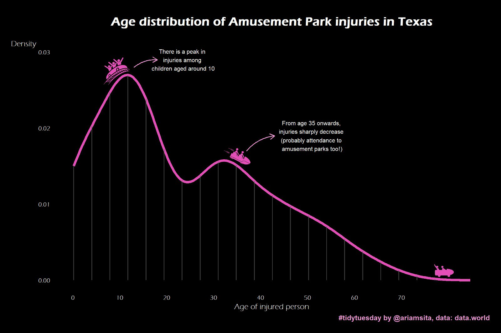
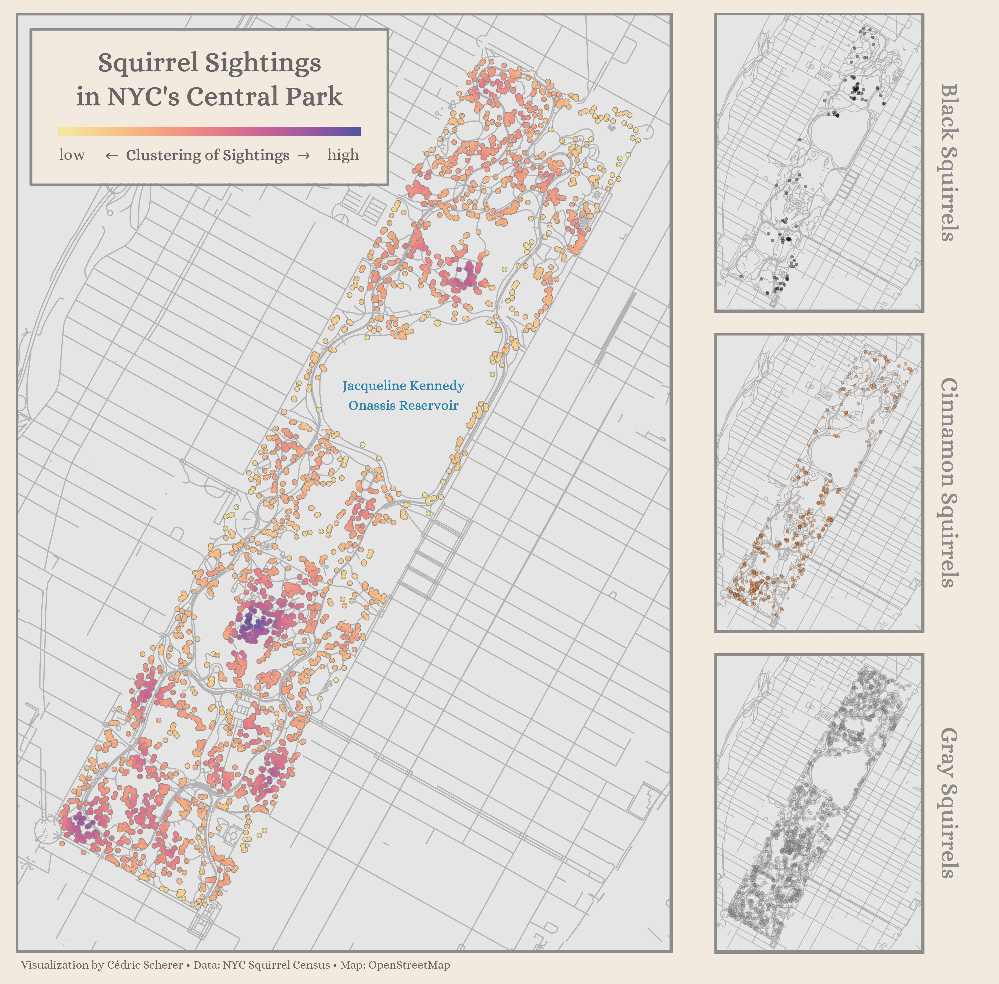
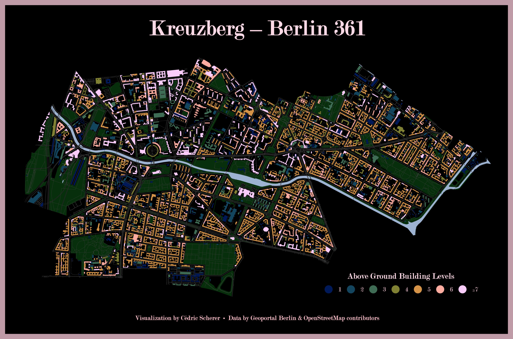
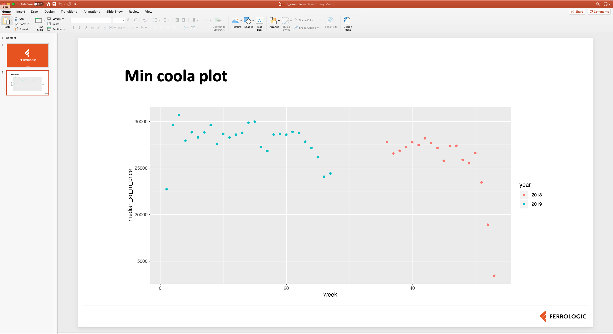

```{r setup, include=FALSE}
knitr::opts_chunk$set(echo = TRUE, message=FALSE, warning=FALSE, dpi = 300, fig.width = 6, fig.height = 4)
```

## Varför ska vi bry oss om datavisualisering?

Anscombe data-set

```{r anscombe, echo=FALSE, message=FALSE, warning=FALSE}
library(tidyverse)
library(broom)
anscombe_tidy <- anscombe %>%
    mutate(observation = seq_len(n())) %>%
    gather(key, value, -observation) %>%
    separate(key, c("variable", "set"), 1, convert = TRUE) %>%
    mutate(set = c("I", "II", "III", "IV")[set]) %>%
    spread(variable, value)

head(anscombe_tidy, 10)
```

---

## Vad är det första vi gör?

```{r anscombe_summary, echo=FALSE, message=FALSE, warning=FALSE}
anscombe_tidy %>%
  group_by(set) %>%
  summarise_at(vars(x, y), lst(mean, sd))
```

---

```{r}
anscombe_tidy %>% 
  nest(observation, x, y) %>% 
  mutate(model = map(data, ~lm(y ~ x, data = .x)),
         tidy = map(model, broom::tidy)) %>% 
  unnest(tidy) %>% 
  filter(term == "x") %>% 
  select(set, estimate, std.error, statistic)
```

---

Men...

```{r echo=FALSE}
ggplot(anscombe_tidy, aes(x, y)) +
  geom_point() +
  facet_wrap(~set) +
  geom_smooth(method = "lm", se = FALSE) +
  theme_light() +
  labs(title = "Anscombe Data Set",
       caption = "Source: Anscombe, F. J. (1973). Graphs in Statistical Analysis")
```

---

```{r}
library(gapminder)
library(ggplot2)
library(gganimate)

p <- ggplot(gapminder, aes(gdpPercap, lifeExp, size = pop, colour = continent)) +
  geom_point(alpha = 0.7) +
  #scale_colour_manual(values = country_colors) +
  scale_size(range = c(2, 12)) +
  scale_x_log10() +
  #facet_wrap(~continent) +
  guides(color= guide_legend(), size=FALSE) +
  theme_light()
# +
  #labs(title = 'Year: {frame_time}', x = 'GDP per capita', y = 'life expectancy') +
  #transition_time(year) +
  #ease_aes('linear')
```

---

```{r}
p
#animate(p, 100, 10)
```

---

# Vad behöver vi för att göra en visualisering?

- En fråga: ex. Hur påverkar ekonomisk utveckling den förväntande livslängden i ett land?

--

- Skiljer sig det här eventuella sambandet mellan kontinenter? Mellan länder?

--

- Skiljer det sig över tid? 

---

# För att svara på frågan behöver vi:

1. Data

```{r}
head(gapminder)
```

---

```{r}
data <- gapminder %>%
  filter(year == 1972)

ggplot(data)
```

---

2. aestsetics

- Vi behöver `mappa` data till visualiseringen. Vi mappar data till `aestethics` i visualiseringen. En `aestetic` kan vara exempelvis `x`-axeln eller `y`-axeln.

- För att svara på vår fråga kan vi exempelvis mappa `gdpPercap` till `x`-axeln och `lifeExp` till `y`-axeln

---

```{r}
ggplot(data = data, mapping = aes(x = gdpPercap, y = lifeExp))
```

---

3. Geometriska objekt

Vi behöver geometrisk object som representerar data, exempelvis punkter eller staplar.

I ggplot2 kallas dessa för `geoms`, exempelvis:

---

```{r}
ggplot(data = data, mapping = aes(x = gdpPercap, y = lifeExp)) +
  geom_point()
```

---

Mer `aestetics`

```{r}
p <- ggplot(data = data,
       mapping = aes(x = gdpPercap,
                     y = lifeExp,
                     color = continent)) + ##
  geom_point()
```

---
```{r}
p
```

---

Och ännu mer `aestetics`

```{r}
p <- ggplot(data = data,
       mapping = aes(x = gdpPercap,
                     y = lifeExp,
                     color = continent,
                     size = pop)) + ##
  geom_point()
```

---

```{r}
p
```

---

4. Skala - Vilken skala ska grafen visas på?

```{r}
p <- ggplot(data = data, mapping = aes(x = gdpPercap, y = lifeExp,
                                  size = pop, color = continent)) +
  geom_point() +
  scale_y_continuous() +
  scale_x_continuous()
```

---

```{r}
p
```

---

gdp per capita är skevt fördelad.

```{r}
ggplot(data, aes(x = gdpPercap)) +
  geom_density()
```

---

Genom att ta logaritmen kan vi justera för den skeva fördelningen.

```{r}
ggplot(data, aes(x = gdpPercap)) +
  geom_density() +
  scale_x_log10()
```

---

```{r}
p <- ggplot(data = data, mapping = aes(x = gdpPercap,
                                  y = lifeExp,
                                  size = pop,
                                  color = continent)) +
  geom_point() +
  scale_x_log10()
```

---

```{r}
p
```

---

Vad mer har vi för grammatiska element?

5. Statistiska beräkningar

```{r}
p <- ggplot(data = data, mapping = aes(x = gdpPercap,
                                  y = lifeExp,
                                  size = pop,
                                  color = continent)) +
  geom_point() +
  scale_x_log10() +
  stat_smooth(method = "lm")
```

---

```{r}
p
```

---

```{r}
p <- ggplot(data = data, mapping = aes(x = gdpPercap,
                                  y = lifeExp,
                                  size = pop,
                                  color = continent)) +
  geom_point() +
  scale_x_log10() +
  stat_smooth(method = "lm", formula = y ~ 1)
```

---

```{r}
p
```

---

- Nu beräknas statistik per grupp. Det är eftersom att vi specificerat i vår `aes()` i `ggplot()`. 

- Vi kan flytta `aes()` till våra geometriska objekt om vi vill beräkna statistik för hela gruppen.

--

```{r}
p <- ggplot(data = data, mapping = aes(x = gdpPercap, y = lifeExp)) +
  geom_point(aes(size = pop, color = continent)) +
  scale_x_log10() +
  stat_smooth(method = "lm")
```

---

```{r}
p
```

---

6. Facets - vill vi visa grupper som flera visualiseringar?

```{r}
p <- ggplot(data = data, mapping = aes(x = gdpPercap,
                                  y = lifeExp,
                                  size = pop,
                                  color = continent)) +
  geom_point() +
  scale_x_log10() +
  stat_smooth(method = "lm") +
  facet_wrap(~continent)
```

---

```{r}
p
```


---

Vi kan specificera skalor för varje subplot

```{r}
p <- ggplot(data = data, mapping = aes(x = gdpPercap,
                                  y = lifeExp,
                                  size = pop,
                                  color = continent)) +
  geom_point() +
  scale_x_log10() +
  stat_smooth(method = "lm") +
  facet_wrap(~continent, scales = "free")
```

---

```{r}
p
```

---

7. Koordinat-system

- Cartesian eller Polar
- Polar för exempelvis cirkeldiagram

---

Grammatik för visualisering:

1. Data
2. Aestetics
3. Geometrical objects
4. Scales
5. Statistics
6. Facets
7. Coordinate system

Alla dessa kan manipuleras

---

Exempel från BBC


---

Georgios Karamanis , @GeorgiosKaramanis på Twitter


---



---



---



---

Nu ska vi praktisera den här grammatiken!

Vi utgår från data som kommer från Hemnet!

```{r}
hem <- read_csv("hemnet/hemnet_data.csv") 

hem
```

---

2. Visualisera relationen mellan `list_price` och `final_price`.
- Vad är dina `aestetics`?
- Vilken `geom_` använder du?
- Passar skalan?
- Finns det någon passande statistic för att visuellt beskriva relationen?

```{r eval=FALSE}
ggplot(data, aes(x = x, y = y)) +
  geom_... +
  stat_...
```

---

```{r}
ggplot(hem, aes(x = list_price, y = final_price)) +
  geom_point() +
  stat_smooth()
```

---

```{r}
ggplot(hem, aes(x = list_price, y = final_price)) +
  geom_point() +
  stat_smooth() +
  scale_y_continuous(labels = scales::comma) +
  scale_x_continuous(labels = scales::comma)
```

---

## Vi kan addera titlar och data-etiketter med `labs()` 

```{r}
p <- ggplot(mtcars, aes(mpg, hp)) +
  geom_point() +
  labs(title = "Min titel",
       x = "Min x-axel",
       y = "Min y-axel", 
       subtitle = "Min subtitle",
       caption = "Källa: Min caption")
```
---
```{r}
p
```

---

## Vi kan ändra tema med `theme_...`

```{r}
p <- ggplot(mtcars, aes(mpg, hp)) +
  geom_point() +
  labs(title = "Min titel",
       x = "Min x-axel",
       y = "Min y-axel", 
       subtitle = "Min subtitle",
       caption = "Källa: Min caption") +
  theme_minimal()
```

---

```{r}
p
```

---

## Övning

- Addera de labels du vill ha, gör dem informativa 
- Addera ett tema 
- Ändra formateringen på y och x-axeln så att siffrorna blir mer lättlästa.

```{r}
p <- ggplot(mtcars, aes(mpg, hp)) +
  geom_point() +
  labs(title = "Min titel",
       x = "Min x-axel",
       y = "Min y-axel", 
       subtitle = "Min subtitle",
       caption = "Källa: Min caption") +
  theme_minimal()
```

---

## Andra aestetics 

- Utgå från din visualisering av relationen mellan utropspris och slutpris
- Mappa vår aestetic `color` till en numerisk variabel, exempelvis `sq_m`, hur hanterar du outliers?

---

```{r eval=FALSE}
ggplot(hem, aes(x = list_price, 
                y = final_price,
                color = ...)) +
  geom_point() +
  stat_smooth()
```

---

```{r}
p <- ggplot(hem, aes(x = list_price, 
                y = final_price,
                color = log10(sq_m))) +
  geom_point() +
  stat_smooth()
```

---

```{r}
p
```

---

## Diskreta variabler

- Utgå från din visualisering av relationen mellan utropspris och slutpris
- Mappa vår aestetic `color` till en kategorisk variabel

```{r eval=FALSE}
p <- ggplot(hem, aes(x = list_price, 
                y = final_price,
                color = ...)) +
  geom_point() +
  stat_smooth()
```

---

```{r echo=FALSE}
p <- ggplot(hem, aes(x = list_price, 
                y = final_price,
                color = as.factor(rooms))) +
  geom_point() +
  stat_smooth()
```
```{r}
p
```

---

## Fler aestetics 

- Utgå från din visualisering av relationen mellan utropspris och slutpris
- Förutom en mappning av color, mappa `size` till en numerisk variabel

---

```{r}
p <- ggplot(hem, aes(x = list_price, 
                     y = final_price,
                     color = as.factor(rooms),
                     size = fee)) +
  geom_point(alpha = .5) +
  stat_smooth()
```

---

```{r}
p
```


---

## Fördelningar 

- Visualisera fördelningar.

---

```{r}
ggplot(gapminder, aes(x = gdpPercap)) +
  geom_density()
```

---

```{r}
ggplot(gapminder, aes(x = gdpPercap)) +
  geom_histogram()
```

---

Visualisera fördelning per kategori

```{r}
ggplot(gapminder, aes(x = continent, y = gdpPercap)) +
  geom_boxplot()
```

---

```{r}
ggplot(gapminder, aes(x = continent, y = gdpPercap)) +
  geom_violin()
```

---

## Skalor och fördelningar 

```{r}
ggplot(gapminder, aes(x = gdpPercap)) +
  geom_histogram() +
  scale_x_log10()
```

---

## Övning: Visualisera försäljningspris 

- Vilken geom använder du och varför?
- Vilken skala använder du?

---

```{r}
p <- ggplot(hem, aes(final_price)) +
  geom_histogram() +
  scale_x_log10()
```

---
```{r}
p
```

---

## Övning: Visualisera fördelningen på pris per bostadstyp

- Använd `coord_flip()` 
- Snygga till y-axeln så att man tydligt ser siffrorna


```{r}
ggplot(hem, aes(type, final_price)) +
  geom_boxplot() +
  coord_flip() +
  scale_y_continuous(labels = scales::comma)
```

---

## Facets 

- Visualisera fördelningen per bostadstyp med sub-plots istället
- Hur hanterar du x-axeln? Finns det något sätt att göra den snyggare?
- För att hantera långa labels i `facet_wrap()` kan du använda funktionen `labeller` och `label_wrap_gen(10)`.


```{r eval=FALSE}
ggplot(hem, aes(final_price)) +
  geom_histogram() +
  scale_x_log10() +
  facet_wrap(~..., labeller = labeller(type = label_wrap_gen(10))))
```

---

```{r}
p <- ggplot(hem, aes(final_price / 1000000)) +
  geom_histogram() +
  scale_x_log10() +
  facet_wrap(~type, scales = "free",
             labeller = labeller(type = label_wrap_gen(15)))
```
---

```{r}
p
```

---

## Barcharts på aggregerade tabeller

Inte sällan har vi aggregerade tabeller som vi vill visualisera.

```{r}
gap_continent <- gapminder %>% 
  group_by(continent) %>% 
  summarise(mean_gdp_per_cap = mean(gdpPercap))

gap_continent
```

---

## geom_col()

- `geom_bar()` används när vi vill veta antalet rader per kategori
- `geom_col()` används på färdiga tabeller
- Sorterar efter bokstavsordning på kategorier

---

```{r}
gap_continent %>% 
  ggplot(aes(x = continent, y = mean_gdp_per_cap)) +
  geom_col()
```

---

Ibland har vi många kategorier, ofta är en enkel lösning att vända på koordinaterna med `coord_flip()`

```{r}
p <- gap_continent %>% 
  ggplot(aes(x = continent, y = mean_gdp_per_cap)) +
  geom_col() +
  coord_flip()
```

---

```{r}
p
```

---

## Hur fördelar sig kvadratmeterpris per mäklare? 

- Ta fram en aggregerad tabell med genomsnittligt kvadratmeterpris per bostadstyp

- Vilken funktion använder du för att kalkylera genomsnitt? Ha fördelningen i åtanke

- Visualisera med `geom_col()`

---

```{r}
tbl_type <- hem %>% 
  group_by(type) %>% 
  summarise(median_sq_m_price = median(square_m_price, na.rm = T))

p <- ggplot(tbl_type, 
            aes(type,
                median_sq_m_price)) +
  geom_col() +
  coord_flip()
```

---


```{r}
p
```

---

## Sortera X-axeln 

- Ofta vill vi sortera X-axeln efter ett värde, exempelvis 
- Då kan vi bara använda `reorder(x, X = sum)`

```{r}
p <- gap_continent %>% 
  ggplot(aes(x = reorder(continent, mean_gdp_per_cap), y = mean_gdp_per_cap)) +
  geom_col() +
  coord_flip()
```

---

```{r}
p
```

---

## Sortera din bar-chart efter medianpris

---
```{r}
p <- ggplot(tbl_type, 
            aes(reorder(type, median_sq_m_price),
                median_sq_m_price)) +
  geom_col() +
  coord_flip()
```

---

```{r}
p
```

---

## Använd `dplyr` och `ggplot2` ihop

```{r}
p <- gapminder %>% 
  group_by(year, continent) %>% 
  summarise(median_gdp_per_cap = median(gdpPercap)) %>% 
  ggplot(aes(year, median_gdp_per_cap, color = continent)) +
  geom_line()
```

---

```{r}
p
```

---

## Tidsserier 

Vi har någon form av tidsserie som vi vill visualisera. Oftast har vi då en tidskomponent, exempelvis dag eller månad. I vår hemnet-data har vi datum. 

- Kalkylera genomsnittligt försäljningspris per dag och visualisera
- Vilken geom använder du?
- Vilken skala använder du?

---

```{r}
 p <- hem %>% 
  group_by(sold_date) %>% 
  summarise(median_sq_m_price = median(square_m_price, na.rm = T)) %>% 
  ggplot(aes(sold_date, y = median_sq_m_price)) +
  geom_line()
```

---

```{r}
p
```

---

## Kalkylera genomsnittligt pris per boendetyp och visualisera

---

```{r}
 p <- hem %>% 
  group_by(sold_date, type) %>% 
  summarise(median_sq_m_price = median(square_m_price, na.rm = T) / 1000000) %>% 
  ggplot(aes(sold_date, y = median_sq_m_price)) +
  geom_line() +
  scale_y_log10() +
  facet_wrap(~type, scales = "free",
             labeller = labeller(type = label_wrap_gen(10)))
```

---

```{r}
p
```

---

## Mer stabila tidsserier

- Inte sällan vill vi ha lite mindre granulära tidsserier, exempelvis per vecka eller månad

--

- Vi kan då använda antigen `lubridate` för att få fram exempelvis `vecka` och `år` 

--

- Eller `tsibble` för att få fram `yearweek` eller `yearmonth`.

--

- Ladda `tsibble` och `lubridate` 

--

- Skapa en kolumn som representera vecka

--

- En som representerar år

--

- En som representerar år-vecka med `tsibble::yearweek()`

--

- Visualisera per år-vecka

--

- Visualisera per vecka och sätt `color = år`

---


---

```{r}
library(lubridate)
library(tsibble)

weekly_sales <- hem %>% 
  mutate(
    year = as.factor(year(sold_date)),
    week = week(sold_date),
    yearweek = yearweek(sold_date)
  )

p <- weekly_sales %>% 
  group_by(yearweek) %>% 
  summarise(median_sq_m_price = median(square_m_price, na.rm = T)) %>% 
  ggplot(aes(yearweek, median_sq_m_price)) +
  geom_point() 
```

---

```{r}
p
```
---

```{r}
p <- weekly_sales %>% 
  group_by(year, week) %>% 
  summarise(median_sq_m_price = median(square_m_price, na.rm = T)) %>% 
  ggplot(aes(week, median_sq_m_price, color = year)) +
  geom_line() 
```

---
```{r}
p
```


---

```{r}
weekly_sales %>% 
  group_by(year) %>% 
  count()
```


---

## Interaktivitet

Med paketet `plotly` kan du ta ett `ggplot2`-objekt och göra om det till en interaktiv graf, som kräver en hemsida.

---
```{r out.width="100%", out.height="100%"}
library(plotly)
ggplotly(p)
```

---

```{r}
library(ggiraph)

data <- weekly_sales %>% 
  group_by(year, week) %>% 
  summarise(median_sq_m_price = median(square_m_price, na.rm = T))

p <- ggplot(data) +
  geom_point_interactive(aes(x = week, y = median_sq_m_price, color = year,
                            tooltip = median_sq_m_price, data_id = median_sq_m_price))
```

---

```{r out.width="100%", out.height="100%"}
girafe(ggobj = p)
```

---

## Att spara din graf

Det enklaste är via `ggsave()` 

```{r eval=FALSE}
ggsave(filename = "median-price-over-time.png", plot = p, width = 10, height = 8)
```

---

## Exportera till powerpoint

- Paketet `officer` gör att du kan skapa powerpoints med teman direkt från R 
- Du behöver bara en presentation som template

---

```{r eval=FALSE}
library(officer)

ppt <- read_pptx("ferro_temp.pptx")

ppt <- ppt %>% 
  add_slide(layout = "Start A - white text", master = "Ferrologic 1.04") %>% 
  ph_with(value = "Min coola presentation", location = ph_location_type(type = "ftr")) %>% 
  add_slide(layout = "Content G", master = "Ferrologic 1.04") %>% 
  ph_with(value = "Min coola plot", location = ph_location_type(type = "title")) %>% 
  ph_with(value = p, location = ph_location_type(type = "body"))

print(ppt, target = "fppt_example.pptx") 
```


---



---

## Extensions

- Det finns ett flertal extensions till ggplot 
- Gå in och kolla på några på https://www.ggplot2-exts.org/

---

## Shiny

- Ett ramverk för att bygga skräddarsydda applikationer i R 

--

- Har likheter med traditionella BI-verktyg men är Open Source och därmed kostnadsfritt

--

- Är mer flexibelt än ett traditionellt BI-verktyg - allt du kan göra i HTML kan du göra i Shiny.

--

- Ett otroligt kraftig verktyg för en Data Scientist - automatisera mera 

--

- Innebär att vi kan paketera analyser som applikationer som användare kan agera med 

--

- Exempelvis ta fram en prognosmodell och låta användare testa att själva ändra paramterar i den, exempelvis vilken typ av säsongsvariation


---

## Nu ska vi göra vår egen Shiny-app! 

- Öppna `hem-shiny-app.Rmd`
- Klicka på `knit`

---


